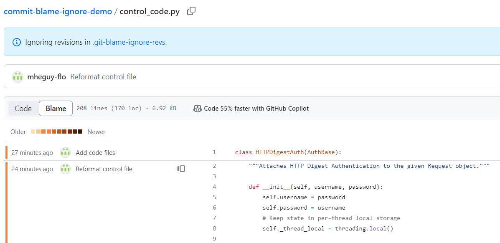
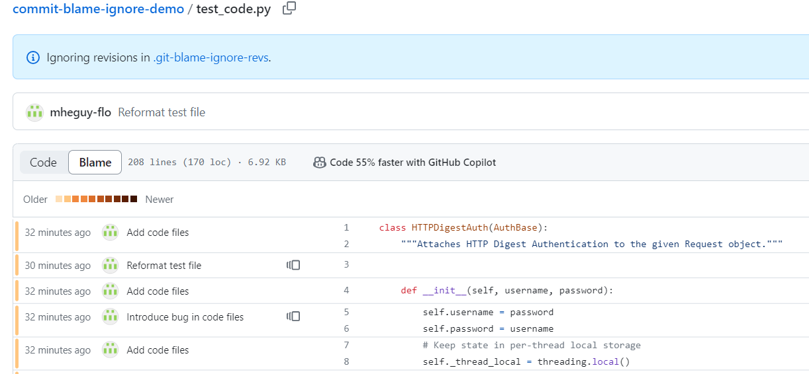

# commit-blame-ignore-demo
A demonstration of ignoring specific commits in git blames.

By introducing a `.git-blame-ignore-revs` file, we can ignore specified commits from affecting git blame. 
This repository has the file control_code.py and test_code.py. Both files have identical code. 
In the case of the control: the commit that reformatted the file **is not** ignored. 
In the case of the test: the commit that reformatted the file **is** ignored. 

By checking the blame of both files we can see the effects. 
Every line is blamed on the reformatting commit:

The formatting commit is ignored:

Modern IDEs will automatically use `.git-blame-ignore-revs` if it is present. 
If your IDE does not, you can run the following to modify your git config: `git config blame.ignoreRevsFile .git-blame-ignore-revs`. 
